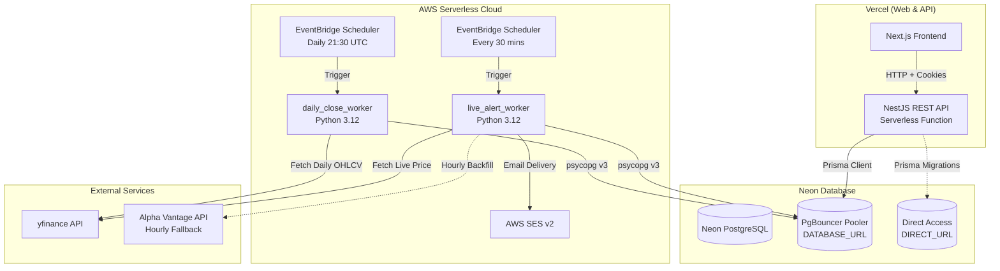
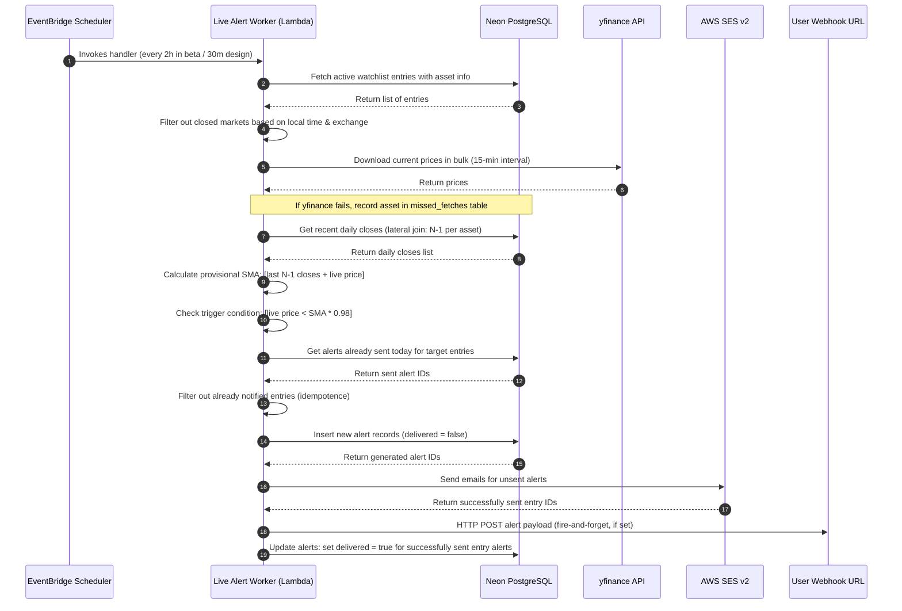

# avgdown System Documentation

A Turborepo-powered monorepo for setting up alert triggers when asset prices drop below a Simple Moving Average (SMA). It targets developers looking to understand the technical details and recruiters looking for a high-quality portfolio architecture.

---

## 1. Project Overview

**avgdown** is a serverless-friendly stock alert and dashboard application. While the system currently triggers notifications based on a rolling daily Simple Moving Average (SMA) period (e.g., 20-day, 50-day, 200-day), the platform is architected to expand and support other technical indicators (such as EMA, RSI, and MACD) in the future. It monitors live asset prices (stocks, crypto) and triggers email notifications and webhook payloads when the asset price dips below the configured threshold.

### Tech Stack & Rationale

- **Monorepo Engine**: [Bun](https://bun.sh) (v1.3.10+) and [Turbo](https://turbo.build) manage the multi-package build pipeline, dependencies, and caching, ensuring fast build times and a unified package system.
- **Frontend**: [Next.js](https://nextjs.org) (App Router) deployed on Vercel. SWR handles data fetching and caching with optimistic UI updates. [Recharts](https://recharts.org) is used for rendering interactive performance charts.
- **Backend REST API**: [NestJS](https://nestjs.com) deployed on Vercel as a Serverless function. NestJS provides dependency injection, global interceptors, and pipes. The validation is managed using `nestjs-zod` and shared Zod schemas.
- **Database**: Serverless [Neon PostgreSQL](https://neon.tech) managed via [Prisma ORM](https://prisma.io). Connection pooling (via Neon's PgBouncer pooled URL) ensures resilience against serverless connection exhaustion.
- **Workers & Automation**: Python 3.12 AWS Lambda functions triggered by AWS EventBridge Scheduler. Python was chosen to leverage the `yfinance` library for financial calculations.
- **Notifications**: AWS Simple Email Service (SESv2) with Easy DKIM and a Custom MAIL FROM domain, ensuring high email deliverability.
- **Infrastructure**: [Terraform](https://terraform.io) manages AWS Lambda deployment zip packaging, S3 state storage, IAM roles, EventBridge rules, and SES domain configuration.

---

## 2. Architecture Overview

The system runs entirely serverless, ensuring zero-cost scaling at personal scale while maintaining strict separation of concerns between user-facing APIs and background workers.

> [!NOTE]
> During beta, the EventBridge Scheduler is configured to trigger the `live_alert_worker` every 2 hours to conserve Neon database compute hours. In a production environment, this is configured to run at its design frequency of every 30 minutes.



### Architectural Design

The codebase is structured as a **monorepo** splitting client, server, and shared package spaces. The backend REST API handles user accounts, watchlist CRUD, and serving historical chart sequences. The workers execute data ingestion, daily close hydration, and alert monitoring asynchronously.
Rather than calculating SMAs on database rows for every single request, the system stores daily price closes in the `daily_price_snapshots` table. The API computes chart SMAs on-the-fly, while the live alert worker loads historical daily closes and runs in-memory calculations, avoiding redundant provider hits.

---

## 3. Directory Structure

```
.
├── apps/
│   ├── api/                   # NestJS REST API (deployed to Vercel)
│   │   ├── src/
│   │   │   ├── auth/          # Authentication strategies (JWT, Google OAuth)
│   │   │   ├── assets/        # Lazy asset lookup & caching
│   │   │   ├── watchlists/    # Watchlist CRUD & chart data calculation
│   │   │   └── main.ts        # API entry bootstrap (Winston, CORS, cookies)
│   │   └── package.json
│   ├── web/                   # Next.js frontend (deployed to Vercel)
│   │   ├── app/               # Page layouts, styles, and routes
│   │   ├── components/        # React components (Dashboard, Watchlists, Settings)
│   │   ├── hooks/             # Data fetching custom SWR hooks
│   │   └── package.json
│   └── worker/                # Python 3.12 Lambda Workers
│       ├── src/
│       │   ├── providers/     # Data providers (yfinance) and SES delivery
│       │   ├── logic/         # In-memory SMA math and alert builders
│       │   ├── db.py          # psycopg v3 helper & raw lateral join SQL
│       │   ├── daily_close_worker.py # [ENTRY POINT] Daily historical close hydrator
│       │   └── live_alert_worker.py  # [ENTRY POINT] Intraday price checker and alerter
│       └── package.json
├── packages/
│   ├── database/              # Shared Database Package
│   │   ├── prisma/
│   │   │   └── schema.prisma  # Single source of truth database schema
│   │   └── package.json
│   ├── types/                 # Shared TypeScript types and Zod schemas
│   │   ├── src/
│   │   │   ├── watchlist.ts   # Watchlist entry schemas & validation
│   │   │   ├── user.ts        # User registration & response validation
│   │   │   └── asset.ts       # Supported asset enums
│   │   └── package.json
│   ├── typescript-config/     # Shared TS configurations
│   └── eslint-config/         # Shared ESLint rules
├── terraform/                 # Infrastructure as Code
│   ├── main.tf                # Backend config & AWS provider assume_role
│   ├── lambda.tf              # Lambda definitions, environments, and runtimes
│   ├── event_bridge.tf        # EventBridge Scheduler cron configurations
│   └── ses.tf                 # SESv2 email identity & custom MAIL FROM
└── scripts/
    └── seed_assets.py         # Script to seed popular stock assets
```

### High-Leverage Files to Read First

1.  [schema.prisma](file:///home/vikram/Dev-Stuff/avgdown/packages/database/prisma/schema.prisma): The foundational relational model representing users, assets, watches, snapshots, and alerts.
2.  [watchlist.ts](file:///home/vikram/Dev-Stuff/avgdown/packages/types/src/watchlist.ts): The Zod definitions detailing how inputs are parsed and outputs are sanitized.
3.  [watchlists.service.ts](file:///home/vikram/Dev-Stuff/avgdown/apps/api/src/watchlists/watchlists.service.ts): The central service managing client queries and on-the-fly chart calculations.
4.  [live_alert_worker.py](file:///home/vikram/Dev-Stuff/avgdown/apps/worker/src/live_alert_worker.py): The entry point managing live price collection and triggering alerts.
5.  [sma.py](file:///home/vikram/Dev-Stuff/avgdown/apps/worker/src/logic/sma.py): Contains the core mathematical comparison loop between live values and completed closes.
6.  [db.py](file:///home/vikram/Dev-Stuff/avgdown/apps/worker/src/db.py): The database interface showing bulk operations and PostgreSQL lateral join logic.

---

## 4. Data Flow

### The Alerting Loop (Live Alert Worker)

The live alert worker runs every 30 minutes. It evaluates active user watchlists, collects stock prices, and fires notifications.



### Authentication & Resilient Registration

Both credentials-based signup and Google OAuth share a unified route structure and write to a single table. Cookies house the JWT.

```mermaid
sequenceDiagram
  autonumber
  actor User
  participant Web as Next.js App
  participant API as NestJS API
  participant Google as Google OAuth Server
  participant DB as Neon PostgreSQL

  %% Credentials Path
  Note over User, DB: Path A — Email/Password Signup
  User->>Web: Input email + password
  Web->>API: POST /auth/register
  API->>API: Hash password (bcrypt, 10 rounds)
  API->>DB: Insert User record
  DB-->>API: Created User
  API-->>Web: Set httpOnly JWT cookie & return 201

  %% Google OAuth Path
  Note over User, DB: Path B — Google OAuth Login
  User->>Web: Click "Sign in with Google"
  Web->>API: GET /auth/oauth/google
  API->>Google: Redirect to consent screen
  Google-->>User: Show login screen
  User->>Google: Authenticate
  Google->>API: Callback with auth code
  API->>Google: Exchange code for profile details
  Google-->>API: Return { email, googleId }
  API->>DB: upsertUser() (Find by googleId or email, update/create)
  Note over API, DB: On P2002 conflict (race condition), retry search and write
  DB-->>API: Return User details
  API->>Web: Set httpOnly JWT cookie & redirect to /dashboard
```



---

## 5. Key Components & Modules

### Backend API Services

#### `WatchlistsService`

- **File**: [watchlists.service.ts](file:///home/vikram/Dev-Stuff/avgdown/apps/api/src/watchlists/watchlists.service.ts)
- **Purpose**: Manages CRUD endpoints, calculates historical chart data, and triggers synchronous data backfilling.
- **Core Logic (`getChartData`)**:
  Queries the daily price snapshot database table for the selected asset, fetching exactly `HISTORY_WINDOW + smaPeriod - 1` closes. It calculates the moving average series on-the-fly and returns the dataset. If the database has fewer closes than `smaPeriod`, it sets the status to `"WARMING_UP"`, allowing the frontend to show a skeleton loader instead of an empty chart.
- **Immediate Hydration (`backfillDailyCloses`)**:
  When a user adds a new watchlist entry, the backend performs a synchronous fetch using `yahoo-finance2` to download the required historical closes. It saves them using a Prisma `$transaction` so the user's chart is populated instantly, without waiting for the nightly cron worker.

#### `UsersService`

- **File**: [users.service.ts](file:///home/vikram/Dev-Stuff/avgdown/apps/api/src/users/users.service.ts)
- **Purpose**: Manages user profiles, account deletion cascades, and OAuth integrations.
- **Resilient OAuth Upsert (`upsertUser`)**:
  During cold starts on Neon's serverless database, interactive transactions can face timeout failures (e.g. Prisma P2028). To prevent this, user upserts are written as simple non-transactional statements. If a race condition triggers a unique constraint collision (Prisma P2002), the error is caught, and the service retries by finding the existing record and updating its Google ID linkage.

### Background Workers

#### `daily_close_worker.py`

- **File**: [daily_close_worker.py](file:///home/vikram/Dev-Stuff/avgdown/apps/worker/src/daily_close_worker.py)
- **Purpose**: Runs daily post-market hours. It updates historical daily closes for all active assets.
- **Details**:
  It queries database coverage, identifies assets missing recent closes, and triggers bulk downloads. Successful results are upserted into `daily_price_snapshots`. It also calls a cleanup script deleting snapshots and logs older than 1 year.

#### `live_alert_worker.py`

- **File**: [live_alert_worker.py](file:///home/vikram/Dev-Stuff/avgdown/apps/worker/src/live_alert_worker.py)
- **Purpose**: Runs every 30 minutes to fetch live prices, compute provisional daily SMAs in-memory, and notify users.
- **Details**:
  Filters out assets whose exchanges are currently closed. It downloads live prices via `yfinance` and retrieves historical closes in a single query via a lateral join. If the price falls below the calculated threshold, it schedules emails and webhooks.

---

## 6. Code Philosophy & Conventions

### 1. Schema Validation (CQRS Segregation)

Zod schemas in [packages/types/src](file:///home/vikram/Dev-Stuff/avgdown/packages/types/src) enforce strict data contract boundaries:

- **Base (`[Resource]Schema`)**: Matches the raw database row structure. Never sent directly to the client to prevent leaking sensitive fields (e.g. `passwordHash`).
- **Create (`[Resource]CreateSchema`)**: Validates payloads sent to `POST` routes, omitting auto-generated database columns.
- **Update (`[Resource]UpdateSchema`)**: Mirrors the creation schema but wraps properties in `.optional()`, enabling clean partial updates.
- **Response (`[Resource]ResponseSchema`)**: Casts data types (e.g. database decimals and dates) to strict JSON-serializable string structures before sending them over HTTP.

### 2. Zero-Config Environment Files

Every deployment block (`apps/api`, `apps/web`, `apps/worker`) houses its own `.env.local` or `.env` file. We avoid a single root-level environment block. This isolates settings and mirrors production deployment targets (Vercel projects and AWS Lambda environments).

### 3. Database Access Pattern

The TypeScript NestJS service layer uses the Prisma Client. In contrast, the Python Lambda workers use raw SQL queries via `psycopg` (v3). This avoids python-prisma runtime translation overhead and matches psycopg's native support for Neon connection pooling.

---

## 7. State Management

The frontend avoids heavy global state managers (like Redux or Zustand) in favor of **Server-State Synchronization** using SWR:

```
+--------------------------------------------------+
|                    Next.js UI                    |
+--------------------------------------------------+
     ^                                        |
     | (Reactive Data)                        | (Mutations / POST)
     |                                        v
+------------------+                    +------------------+
|    SWR Cache     |                    |   API Endpoints  |
+------------------+                    +------------------+
     ^                                        |
     | (Automatic Background Revalidation)    | (Write to DB)
     +----------------------------------------+
```

- **SWR Hook System**: Client pages fetch watchlist records using custom hooks (e.g. [useWatchlists.ts](file:///home/vikram/Dev-Stuff/avgdown/apps/web/hooks/useWatchlists.ts)). SWR caches the response, updates the UI immediately, and triggers background revalidation.
- **Optimistic UI Mutators**: When a watchlist entry is deleted or updated, the application triggers a local cache mutate. SWR updates the UI instantly, calls the API in the background, and rolls back changes if the API request fails.

---

## 8. API & External Integrations

### 1. Yahoo Finance (`yfinance` & `yahoo-finance2`)

- **Python Worker**: `yfinance` fetches bulk prices and daily closes. The system groups tickers for bulk downloads to prevent rate limiting.
- **API**: `yahoo-finance2` is used for synchronous historical backfilling during watchlist creation.

### 2. AWS SES v2

- **Setup**: Handles email alerts.
- **Configuration Set**: Bound to the verified domain identity (`avgdown-ses-configs`), which redirects delivery logs (SEND, DELIVERY, BOUNCE, COMPLAINT, REJECT) to CloudWatch.
- **Custom MAIL FROM Domain**: The system sets the envelope sender to `mail.yourdomain.com` and configures Easy DKIM (using 3 CNAME DNS records) to ensure emails pass DMARC checks.

### 3. Alpha Vantage (Backup Ingestion Provider)

- **Role**: Serves as a fallback provider when yfinance scraping fails.
- **Strategy**: If yfinance fails to fetch a symbol's price, a record is added to the `missed_fetches` table. An hourly cron job processes unresolved entries by calling the Alpha Vantage API (limited to 25 free queries/day).

---

## 9. Scalability & Future Roadmap

```
Phase 1: Foundation (Current)     Phase 2: Observability & Fallbacks     Phase 3: Scale Up (Future)
+-----------------------------+   +-------------------------------+   +-----------------------------+
| • yfinance Price Collection |-->| • Winston JSON Logging        |-->| • Paid API (Upstox) Migration|
| • On-The-Fly SMA Math       |   | • CloudWatch & Grafana        |   | • SQS Queue Concurrency     |
| • AWS SES v2 Email Alerts   |   | • Alpha Vantage Backfill      |   | • Time-Weighted SMA Calcs   |
+-----------------------------+   +-------------------------------+   +-----------------------------+
```

### 1. Observability Layer (Winston + CloudWatch + Grafana)

- **NestJS logging**: All logs are managed using `nest-winston`. Production logs are formatted as structured JSON, making them easy to query in log aggregators.
- **CloudWatch & Grafana Cloud**: Lambda logs are sent to CloudWatch. A custom metric alarm triggers notifications on high Lambda error rates or long runtimes. These metrics are visualized in Grafana Cloud dashboards.

### 2. Paid Provider Upgrade (Upstox API)

If yfinance's scraping structure breaks under load, the system is designed to transition to a paid broker API (e.g. Upstox API). The provider logic is isolated in [yf.py](file:///home/vikram/Dev-Stuff/avgdown/apps/worker/src/providers/yf.py), allowing developers to add a new provider without modifying the database or alerting logic.

### 3. Message Queue Batching (SQS & Lambda Concurrency)

If watchlist sizes scale to thousands of users, processing them sequentially in a single Lambda run could timeout.

- **Future Design**: The EventBridge Scheduler will trigger a dispatch Lambda that writes message batches to an **Amazon SQS Queue**.
- **Execution**: Worker Lambdas will scale horizontally by pulling messages from the queue. This prevents connection bottlenecks on the PostgreSQL database.

---

## 10. Setup & Running Locally

### Prerequisites

- [Bun](https://bun.sh) (v1.3.10 or higher)
- [Python](https://www.python.org/) (v3.12 or higher)
- An active AWS account (for SES and Lambda setup)

### Step 1: Clone and Install Node Dependencies

```bash
git clone <repo-url>
cd avgdown
bun install
```

### Step 2: Configure Environment Files

Create a `.env.local` file at the root of the repository:

```bash
DATABASE_URL="postgresql://<username>:<password>@<neon-pooled-url>/avgdown?sslmode=require"
DIRECT_URL="postgresql://<username>:<password>@<neon-direct-url>/avgdown?sslmode=require"
JWT_SECRET="generate-a-long-random-string-here"
JWT_EXPIRY="7d"
GOOGLE_CLIENT_ID="your-google-oauth-client-id"
GOOGLE_CLIENT_SECRET="your-google-oauth-client-secret"
GOOGLE_CALLBACK_URL="http://localhost:3001/auth/oauth/google/callback"
FRONTEND_URL="http://localhost:3000"
PORT="3001"
```

Copy this `.env.local` to the corresponding application directories:

```bash
cp .env.local apps/api/.env.local
cp .env.local apps/web/.env.local
```

For the worker, create `apps/worker/.env`:

```bash
DATABASE_URL="postgresql://<username>:<password>@<neon-pooled-url>/avgdown?sslmode=require"
ENVIRONMENT="development"
LOG_LEVEL="info"
DOMAIN_NAME="localhost"
```

### Step 3: Run Database Migrations & Seed Assets

```bash
# Generate the Prisma client
bun db:generate

# Apply migrations to database
bun db:deploy

# Run Python asset seeder
source .venv/bin/activate
pip install -r scripts/requirements.txt
python scripts/seed_assets.py
```

### Step 4: Install Worker Dependencies

```bash
cd apps/worker
# Install worker libraries locally
pip install -r requirements.txt
```

### Step 5: Start Local Development Services

Run the Next.js frontend and NestJS API in parallel:

```bash
# Run from repository root
bun run dev
```

- **Frontend**: `http://localhost:3000`
- **NestJS Swagger Docs**: `http://localhost:3001/api`

### Step 6: Test Worker Execution

To run the background workers locally for debugging:

```bash
# Daily close hydrator
python apps/worker/src/daily_close_worker.py

# Intraday alert checker
python apps/worker/src/live_alert_worker.py
```

---
## 11. Known Limitations & TODOs

1.  **Fire-and-Forget Webhooks**:
    Webhook notifications are sent directly from the worker. If the recipient's endpoint is down, the request fails silently and is only logged. A retry queue using SQS and dead-letter queues is planned.
2.  **Time-Weighted SMA Gaps**:
    The SMA calculation assumes a constant frequency of daily price snapshots. If a price check is missed due to provider outages, the average window drifts slightly. Time-weighted SMA formulas will be introduced in future updates.
3.  **Secure Unsubscribe Link**:
    Emails do not currently include a secure unsubscribe option. We plan to add a pre-signed unsubscribe link containing an encrypted token, allowing users to disable alerts with a single click.
4.  **User-Selectable Deviation Threshold**:
    The deviation threshold for price alerts is currently hardcoded to 2% (`0.02`) in [live_alert_worker.py](file:///home/vikram/Dev-Stuff/avgdown/apps/worker/src/live_alert_worker.py#L96). In the future, this will be made configurable per watchlist entry by adding a field to the database and exposing it on the frontend watchlist form.
5.  **Idempotence Delivery Failure Edge Case**:
    Since alerts are written to the database before the email dispatch is attempted, any crash that happens _after_ the database write but _before_ the email is sent will result in the alert being permanently skipped for that day. This is because subsequent worker runs filter out any entries that already have an alert row created on the current calendar day, regardless of whether `delivered` is true or false.
