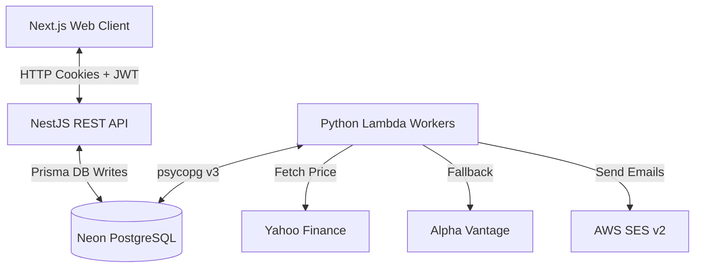
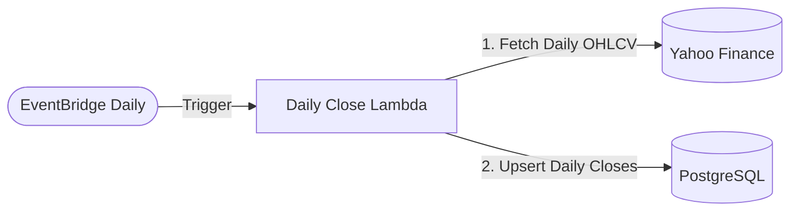
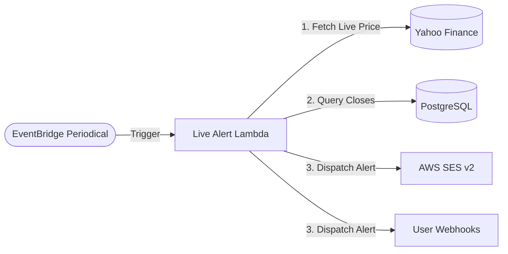

<div align="center">
  <div style="background-color: #0b1329; border: 1px solid #1e293b; border-radius: 16px; padding: 48px 24px; max-width: 650px; margin: 24px auto; text-align: center; box-shadow: 0 10px 30px rgba(0, 0, 0, 0.3);">
    <h1 style="color: #38bdf8; font-family: -apple-system, BlinkMacSystemFont, 'Segoe UI', 'Inter', sans-serif; font-size: 52px; font-weight: 850; letter-spacing: -2.5px; margin: 0 0 8px 0; background: linear-gradient(135deg, #38bdf8 0%, #818cf8 50%, #c084fc 100%); -webkit-background-clip: text; -webkit-text-fill-color: transparent; filter: drop-shadow(0 2px 8px rgba(56, 189, 248, 0.15));">avgdown</h1>
    <p style="color: #94a3b8; font-family: -apple-system, BlinkMacSystemFont, 'Segoe UI', 'Inter', sans-serif; font-size: 13px; font-weight: 600; letter-spacing: 2.5px; text-transform: uppercase; margin: 0 0 20px 0;">Serverless Technical Indicator Alerting Platform</p>
    <a href="https://avgdown.xyz" style="display: inline-block; color: #38bdf8; font-family: -apple-system, BlinkMacSystemFont, 'Segoe UI', 'Inter', sans-serif; font-size: 13px; font-weight: 700; text-decoration: none; border: 1px solid #334155; border-radius: 9999px; padding: 6px 20px; background-color: #1e293b; box-shadow: 0 4px 12px rgba(0,0,0,0.15); transition: background-color 0.2s;">🌐 avgdown.xyz</a>
  </div>
</div>

<p align="center">
  <a href="https://turbo.build"></a>
  <a href="https://bun.sh"></a>
  <a href="https://nestjs.com"></a>
  <a href="https://nextjs.org"></a>
  <a href="https://terraform.io"></a>
</p>

---

## 🚀 What is avgdown?

**avgdown** is a serverless stock alert and portfolio tracking system. It enables users to monitor financial assets (US stocks, Indian equities, and crypto) and receive instant email notifications and webhook payloads when an asset's live price dips below its configured technical threshold.

The platform currently implements **Simple Moving Averages (SMA)** (e.g., 20-day, 50-day, 200-day) with a modular engine built to expand to additional technical indicators (such as EMA, RSI, and MACD) in the near future.

---

## 🏗️ System Architecture

The entire stack is deployed serverless, allowing the project to scale down to absolute zero costs during inactivity.



---

## 🔔 Hydration & Alerting Flows

The background worker system uses two dedicated Python Lambda functions to handle daily data hydration and scheduled alert checks:

### 1. Daily Close Hydration (`daily_close_worker`)

Runs once daily post-market close to collect completed trading candles:



### 2. Intraday Alert Checks (`live_alert_worker`)

Runs periodically during market hours to compare live prices against technical thresholds:



---

## 💎 Architectural Highlights

- **Asset-First Fan-Out**: Users watch symbols, but the worker doesn't hammer third-party APIs. The background lambda queries distinct assets, fetches live prices **exactly once**, writes a single snapshot, and fans out SMA calculations and email notifications to all watchers of that asset. One API call $\rightarrow$ $N$ users alerted.
- **Fully Serverless Pipeline ($0 Running Cost)**:
  - **Frontend & API**: Next.js and NestJS run as serverless edge functions on Vercel, scaling down to absolute zero.
  - **Data Ingestion**: Python AWS Lambdas triggered by EventBridge schedulers wake up, execute price checks, and shut down within 10 seconds.
  - **Storage**: Neon's Serverless PostgreSQL sleeps when inactive, using a pooled configuration to absorb serverless connection concurrency.
- **Zod-Driven CQRS Validation**: Shared Zod schemas in [packages/types](packages/types) enforce compile-time safety across both the TypeScript API and Next.js frontend, segregating models into Base, Create, Update, and Response configurations.

---

## 🛠️ The Tech Stack

| Layer        | Technology                 | Role                                                                 |
| :----------- | :------------------------- | :------------------------------------------------------------------- |
| **Monorepo** | Bun + Turborepo            | Dependency caching, task pipelines, shared package scopes.           |
| **Client**   | Next.js (App Router) + SWR | SPA interface, caching, local state optimistic updates.              |
| **Server**   | NestJS + Winston           | Clean REST endpoints, structured JSON logging, global guards.        |
| **Database** | Neon PostgreSQL + Prisma   | Serverless database cluster, PgBouncer pooling, schema migrations.   |
| **Workers**  | Python 3.12 + psycopg v3   | EventBridge-triggered Lambda execution, high-performance DB drivers. |
| **Infra**    | Terraform                  | AWS resources provisioning (IAM roles, Lambdas, S3 states, SES).     |

---

## 🏎️ Quick Start

### Prerequisites

- [Bun](https://bun.sh) (v1.3.10+)
- [Python](https://www.python.org/) (v3.12+)

### Setup & Run

1.  **Install dependencies**:
    ```bash
    bun install
    ```
2.  **Configure environment**:
    Create `.env.local` at the root and copy it to application directories:
    ```bash
    cp .env.local apps/api/.env.local
    cp .env.local apps/web/.env.local
    ```
3.  **Deploy database & seed assets**:
    ```bash
    bun db:generate
    bun db:deploy
    source .venv/bin/activate && python scripts/seed_assets.py
    ```
4.  **Launch local development**:

    ```bash
    bun run dev
    ```

    - Frontend: `http://localhost:3000`
    - Backend API (Swagger Docs): `http://localhost:3001/api`

---

## 📖 Deep-Dive Documentation

For full system details, including detailed sequence flows, database relation layouts, lateral join explanations, and deployment configurations, read the **[Full Developer Documentation](DOCUMENTATION.md)**.
